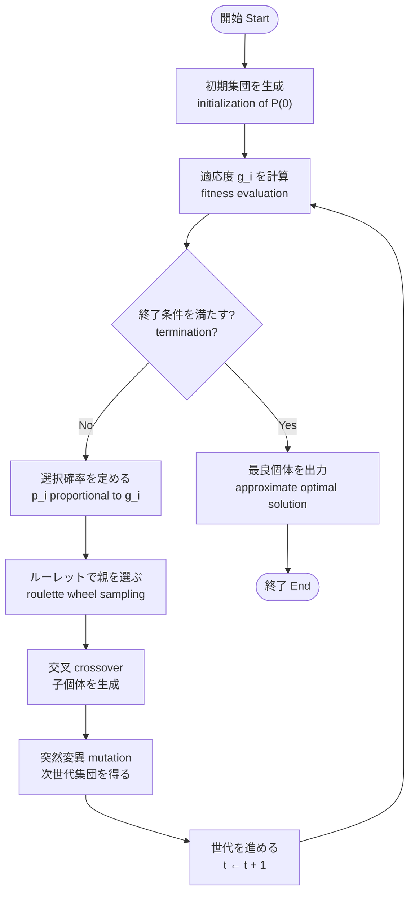

# 第2回：遺伝的アルゴリズム（GA）で巡回セールスマン問題（TSP）を解く

```{dropdown} NOTE: この資料について
この資料は第1回の続きである。  
第1回で学んだ「組合せ最適化」「解の表現」「目的関数」を踏まえ、遺伝的アルゴリズム（GA）による巡回セールスマン問題（TSP）の解法をまとめる。  
用語とアルゴリズムの流れは [遺伝的アルゴリズム（立命館大学 情報理工学部 資料）](https://www.sys.ci.ritsumei.ac.jp/project/theory/ga/node1.html) に概ね沿っている。  
Python での実装例は **9. 参考資料** の文献も参照するとよい。
```

---

## 0. 第2回の到達目標

第2回終了時に、次を説明・実装のイメージまで持てる状態を目指す。

1. TSP を **順列（permutation；巡回順・ツアー）** としてモデル化し、 **目的関数（objective function）** （総距離）を定義できる。  
2. GA の **遺伝的操作（genetic operators）** （選択・交叉・突然変異）と **個体集団（population）** $P(t)$ の更新を説明できる。  
3. TSP において **順序を保つ交叉（order-preserving crossover）** （順序交叉など）が必要な理由を説明できる。  
4. パラメータ（ **個体数（population size）** 、 **世代数（number of generations）** 、 **交叉率（crossover rate）** 、 **突然変異率（mutation rate）** 、 **エリート数（elite count）** ）が結果に与える影響を定性的に述べられる。

---

## 1. 本日の位置づけ（第1回との接続）

第1回では次を整理した。

- 組合せ最適化では解候補が膨大になり、全探索が非現実的になりやすい。  
- **メタヒューリスティクス（metaheuristics）** は、汎用的な探索の枠組みとして近似解を求める。

本日はその代表の一つである **遺伝的アルゴリズム（GA: Genetic Algorithm）** を題材に、 **巡回セールスマン問題（TSP: Traveling Salesman Problem）** に適用する流れを一通り扱う。

---

## 2. TSP の定式化（復習）

### 2.1 問題の言い換え

- $n$ 個の都市（地点）があり、各都市はちょうど1回ずつ訪問する。  
- 出発都市に戻る **閉路（closed tour / Hamiltonian cycle）** とする（ここではこの形を扱う）。  
- 隣接都市間の **距離（distance）** または **移動コスト（travel cost）** が与えられる。  
-  **総移動距離（総コスト）を最小化（minimize）** する巡回順序を求める。

### 2.2 解の表現

都市に $0, 1, \ldots, n-1$ の番号を付ける。  
解は **都市番号の順列**  $\pi = (\pi_0, \pi_1, \ldots, \pi_{n-1})$ で表す。

- $\pi_k$: $k$ 番目に訪問する都市の番号（順列を **染色体（chromosome）** とみなすとき、各位置の値を **遺伝子（gene）** と呼ぶ）  
- 順列であること自体が「各都市を一度ずつ訪れる」という **制約（constraint）** を表す  
- ここでは染色体と巡回順序（ **表現型（phenotype）** ）を同一視して扱う（ **遺伝子型（genotype）** と区別しない簡略モデル）

### 2.3 目的関数（評価値）

2次元座標 $(x_i, y_i)$ が与えられる場合、 **ユークリッド距離（Euclidean distance）** を用いることが多い。

$$
d(i, j) = \sqrt{(x_i - x_j)^2 + (y_i - y_j)^2}
$$

総距離（最小化したい量）は次である。

$$
L(\pi) = \sum_{k=0}^{n-2} d(\pi_k, \pi_{k+1}) + d(\pi_{n-1}, \pi_0)
$$

#### 無向グラフとして与えられる場合

都市を **頂点（vertex；ノード node）** とみなし、都市間の移動コストを **無向辺の重み（undirected edge weight）** として与えた **無向グラフ（undirected graph）** $G=(V,E)$ が与えられる場合もある。  
頂点集合 $V$ の各要素が都市に対応し、辺 $\{i,j\} \in E$ には非負の重み $w_{ij}=w_{ji}$ が付く（ **完全グラフ（complete graph）** であれば、任意の都市の組に辺があり、どの順序でも巡回できる）。

このとき、巡回順 $\pi$ に沿った総コストは、辺の重みの和として次で与えられる。

$$
L(\pi) = \sum_{k=0}^{n-2} w_{\pi_k,\pi_{k+1}} + w_{\pi_{n-1},\pi_0}
$$

各都市対がユークリッド距離 $d(i,j)$ で結ばれる完全無向グラフとみなすと $w_{ij}=d(i,j)$ となり、上の座標による定義と一致する。

**個体（individual）** $i$ の染色体に対応する巡回を $\pi^{(i)}$ と書く。 **目的関数値（objective value）** は $L(\pi^{(i)})$ である。  
参考資料と同様に **適応度（fitness）** を $g_i$ と書く場合、 **最大化（maximization）** する GA では $g_i$ が大きいほど良い個体となる。  
TSP のように **最小化（minimization）** する場合は、例えば $g_i = 1 / L(\pi^{(i)})$ や $g_i = -L(\pi^{(i)})$ など、 $g_i$ が良い解ほど大きくなるように定めてから **選択（selection）** に用いる（実装で `min` を直接使っても、概念上は適応度に読み替えられる）。

```{dropdown} NOTE: 距離行列で書く場合
座標でもグラフでも、実装ではしばしば **距離行列（distance matrix）** $D=(d_{ij})$ （または **重み行列（weight matrix）** $W=(w_{ij})$）を保持する。  
無向なら $d_{ij}=d_{ji}$（または $w_{ij}=w_{ji}$）である。  
そのとき目的関数は  
$L(\pi) = \sum_{k=0}^{n-2} d_{\pi_k,\pi_{k+1}} + d_{\pi_{n-1},\pi_0}$  
と書ける（グラフの重みなら $d$ を $w$ と読み替える）。  
グラフが完全でない場合は、用いる順列が実際に存在する辺だけを通るように制約を課す、あるいは不存在辺に十分大きなペナルティを与える、など別の定式化が必要になる。
```

---

## 3. 遺伝的アルゴリズム（GA）の概要

### 3.0 用語集（Glossary）

GA の説明に先立ち、本資料で繰り返す語を整理する。  
定義の骨格は東京大学伊庭研究室の解説「[遺伝的アルゴリズム](http://www.iba.t.u-tokyo.ac.jp/rs/ga.html)」に沿う。  
TSP の章（§2）では **遺伝子型（genotype）** と **表現型（phenotype）** を同一視する簡略モデルも扱うが、ここでは一般の二層表現も含めて示す。

| 用語 | 英語など | 意味（要約） |
| --- | --- | --- |
| 遺伝子型 | genotype；GTYPE | GA の **オペレータ（交叉・突然変異など）が直接いじる内部表現**。配列やビット列などで符号化する。 |
| 表現型 | phenotype；PTYPE | GTYPE が **問題の文脈でどう解として解釈されるか**（行動・構造・ツアーなど）。本資料の TSP では順列がそのまま表現型になりうる。 |
| 符号化 | encoding | 問題の解を GTYPE に **対応づける設計**（TSP では順列への符号化が典型）。 |
| 個体 | individual | **1 つの解候補**。GTYPE（と必要なら PTYPE）と適応度を持つ。 |
| 集団・個体集団 | population | 複数個体の集まり。世代 $t$ の集団を $P(t)$ と書く。 |
| 世代 | generation | 集団を **1 回更新するステップ**の添字 $t$。 |
| 適応度・適合度 | fitness | 個体の良さを数値化した量。**最大化**する設定が多い。最小化問題では $L$ から変換して定義する（§2.3）。 |
| 選択・淘汰 | selection | 適応度に応じて **親や生存個体を選ぶ**操作。 |
| ルーレット選択 | roulette wheel selection | 適応度に **比例した確率**で個体を選ぶ選択。 |
| トーナメント選択 | tournament selection | 集団から **トーナメントサイズ**個を無作為に取り、その中の最良を選ぶ。サイズで圧力を調整できる。 |
| エリート戦略 | elitism；elite strategy | **最良個体を次世代にそのまま残す**こと。良い解が偶然消えるのを防ぐ。他の選択法と併用される。 |
| 交叉 | crossover | 2 個以上の親の GTYPE を **組み替え**て子を作るオペレータ。 |
| 突然変異 | mutation | GTYPE を **確率的に小さく変える**オペレータ。多様性を保つ。 |
| 遺伝的操作・GA オペレータ | genetic operators | 選択に続き、主に **交叉と突然変異**を指す（生殖・組換えのアナロジー）。 |
| 生殖・再生 | recombination；reproduction | 親から子世代を **生成する過程**全体。実装では選択→交叉→突然変異→世代交代に対応することが多い。 |
| 終了条件 | termination condition | 世代数上限、時間、改善停滞など **繰り返しを止める条件**。 |

GA は、生物の進化を比喩にした探索である。  
**個体（individual）** は1つの解候補であり、 **染色体（chromosome）** で **符号化（encoding）** される。複数個体からなる **個体集団（population；集団）** を $P(t)$ と書き、添字 $t$ を **世代（generation）** （更新のステップ）とする。  
個体に対する **遺伝的操作（genetic operators）** として、参考資料と同様に次の三つを繰り返す。

1. **選択（selection）**  
2. **交叉（crossover）**  
3. **突然変異（mutation）**

### 3.1 全体の流れ（参考資料のアルゴリズムに対応）

参考資料では、世代 $t$ の個体集団 $P(t)$ に対し、選択・交叉・突然変異を順に適用して $P(t+1)$ を得る流れが示されている。ここでは次の記号を用いる。

- $P(t)$: 世代 $t$ の個体集団  
- 選択操作の結果を $P'(t)$、交叉後を $P''(t)$、突然変異後を $P(t+1)$ とみなす（プログラムでは $P'$ などを別配列にせず上書きしてもよい）

**$1^{\circ}$** **個体数（population size）** $M$ の初期集団 $P(0)$ を生成し、 $t=0$ とする。最大世代数など **終了条件（termination condition）** を $T$ としておく。  

**$2^{\circ}$** $P(t)$ の各個体 $i$ について **適応度（fitness）** $g_i$ を計算する（最小化なら $L$ から $g_i$ を定義する）。  

**$3^{\circ}$** $P(t)$ に **選択操作（selection operator）** を適用し、親候補の集団 $P'(t)$ を得る。  

**$4^{\circ}$** $P'(t)$ に **交叉操作（crossover operator）** を適用し、 $P''(t)$ を得る（一定 **交叉確率（crossover probability）** で親の組を選ぶ、など）。  

**$5^{\circ}$** $P''(t)$ に **突然変異操作（mutation operator）** を適用し、次世代の個体集団 $P(t+1)$ を得る（各遺伝子が **突然変異確率（mutation probability）** に従って変化する、など）。  

**$6^{\circ}$** 終了条件を満たすまで $t \leftarrow t+1$ として $2^{\circ}$ へ戻る。終了後、これまでの中で最も適応度が高い（または $L$ が最小の）個体を **近似最適解（approximate optimal solution）** として出力する。

### GA の流れ（ブロック図）

選択の段階を **適応度比例選択（ルーレット選択；roulette wheel selection）** としたときの流れを図示する。



### 3.2 基本ステップ（実装・理解のチェックリスト）

アルゴリズムをプログラムに落とすとき、次の順で確認するとよい。

1.  **初期個体群の生成（initialization）**  
   ランダムな順列（染色体）を $M$ 本生成し、 $P(0)$ とする。

2.  **評価（evaluation；適応度の計算 fitness evaluation）**  
   各個体の $L(\pi)$ を求め、必要なら $g_i$ に変換する。

3.  **選択（selection）**  
   適応度に応じて親を選ぶ（例: **適応度比例選択（ルーレット選択；roulette wheel selection）** 。別法として **トーナメント選択（tournament selection）** もよく用いられる）。

4.  **交叉（crossover）**  
   2つの親から子を作る。TSP では **順序を保つ交叉（order-preserving crossover）** が重要である（§4.4）。

5.  **突然変異（mutation）**  
   一定確率で染色体を変える（例: 2 **遺伝子（genes）** の **スワップ（swap）** ）。

6.  **世代交代（replacement / generational replacement）**  
   子個体（と **エリート（elite）** ）から $P(t+1)$ を構成する。

7. 世代数上限 $T$ 、または評価の改善が頭打ちになるまで 2〜6 を繰り返す。

```{dropdown} NOTE: GA は最適解を保証しない
GA は一般に **最適解の保証はない** 。  
得られるのは「制限時間・世代数の中で見つかった良い近似解」である。  
評価には **最良値の推移** や **複数回試行でのばらつき** を見ることが重要である。
```

---

## 4. TSP における GA の設計（§3.2 のステップに対応）

§3.2 のチェックリストと **同じ順序** で、TSP を染色体にしたときの設計上の要点をまとめる。実装するときは、この章を上から順に読みながら各関数を対応づけるとよい。

各節の **Python の例** は学習用の断片である。**必要な import**（標準ライブラリの `typing`、サードパーティの `matplotlib` と `numpy`）は **§4.1 の最初のコードブロックに一度だけ** 示す。以降の各節のブロックでは import を繰り返さない。1つのスクリプトにまとめるときも同様に先頭へ集約し、 **関数の定義順** （後の節が前の節の関数を呼ぶ場合は、被依存側を上に置く）を調整すること。 **NumPy** の `ndarray` と `numpy.random.Generator` を用い、座標・集団・距離の計算をベクトル化する。

### 4.1 ステップ1：初期個体群の生成（initialization）

- 都市の座標（または距離行列）を用意し、問題インスタンスを定める。  
- **個体数（population size）** $M$ 個の **順列（permutation）** を、重複のない巡回順になるよう **ランダムに生成** し、初期集団 $P(0)$ とする。  
- 乱数の **シード（seed）** を固定しておくと、結果の再現やデバッグがしやすい。

```python
from typing import Optional

import matplotlib.pyplot as plt
import numpy as np


def random_city_coords(
    n: int, xmax: int, ymax: int, rng: np.random.Generator
) -> np.ndarray:
    """整数範囲内に n 都市の 2 次元座標を乱数で生成する。

    Args:
        n: 都市数。
        xmax: x 座標の最大値（0 以上 xmax 以下の整数）。
        ymax: y 座標の最大値（0 以上 ymax 以下の整数）。
        rng: NumPy の擬似乱数ジェネレータ。

    Returns:
        形状 ``(n, 2)`` の float64 配列。各行が都市の ``(x, y)`` 。
    """
    x = rng.integers(0, xmax + 1, size=n)
    y = rng.integers(0, ymax + 1, size=n)
    return np.column_stack([x, y]).astype(np.float64)


def random_permutation(n: int, rng: np.random.Generator) -> np.ndarray:
    """TSP 用の1本の染色体（0..n-1 の順列）を生成する。

    Args:
        n: 都市数（遺伝子長）。
        rng: NumPy の擬似乱数ジェネレータ。

    Returns:
        形状 ``(n,)`` の int64 配列。都市インデックスの順列。
    """
    return rng.permutation(n).astype(np.int64)


def initial_population(
    pop_size: int, n: int, rng: np.random.Generator
) -> np.ndarray:
    """初期集団 ``P(0)`` をランダム順列で構築する。

    Args:
        pop_size: 個体数。
        n: 1 個体あたりの遺伝子長（都市数）。
        rng: NumPy の擬似乱数ジェネレータ。

    Returns:
        形状 ``(pop_size, n)`` の int64 配列。各行が1個体の順列。
    """
    rows = [random_permutation(n, rng) for _ in range(pop_size)]
    return np.stack(rows, axis=0)


# 例: 再現性のためビットジェネレータにシードを渡す
rng = np.random.default_rng(42)
coords = random_city_coords(8, 200, 200, rng)
population = initial_population(pop_size=30, n=coords.shape[0], rng=rng)
```

### 4.2 ステップ2：評価（evaluation；適応度の計算）

- 各個体の染色体（巡回順）に対し、§2.3 の **目的関数値（objective value）** $L(\pi)$ を計算する。  
- **最小化** の GA で **選択** に使う場合は、 $L$ から **適応度（fitness）** $g_i$ を「大きいほど良い」ように定める（例: $g_i = 1/L$ 、 $g_i = -L$ ）。  
- 距離行列やグラフ重みを保持しておくと、評価のたびに同じ計算を簡潔に書ける。

```python
def tour_length(route: np.ndarray, coords: np.ndarray) -> float:
    """1 個体の閉路ツアー長（ユークリッド距離の和）を計算する。

    Args:
        route: 訪問順。形状 ``(n,)`` の都市インデックスの順列。
        coords: 都市座標。形状 ``(n, 2)`` 。

    Returns:
        出発都市へ戻る閉路の総距離（スカラー）。
    """
    pts = coords[route.astype(np.intp)]
    seg = np.linalg.norm(np.diff(pts, axis=0), axis=1)
    closing = np.linalg.norm(pts[-1] - pts[0])
    return float(seg.sum() + closing)


def tour_lengths(population: np.ndarray, coords: np.ndarray) -> np.ndarray:
    """集団全個体のツアー長をベクトル化して計算する。

    Args:
        population: 形状 ``(P, n)`` 。各行が1個体の順列。
        coords: 都市座標。形状 ``(n, 2)`` 。

    Returns:
        形状 ``(P,)`` の float 配列。各要素が対応する個体の ``L`` 。
    """
    pts = coords[population.astype(np.intp)]  # (P, n, 2)
    seg = np.linalg.norm(np.diff(pts, axis=1), axis=2)
    closing = np.linalg.norm(pts[:, -1, :] - pts[:, 0, :], axis=1)
    return seg.sum(axis=1) + closing


def fitness_from_lengths(lengths: np.ndarray, eps: float = 1e-9) -> np.ndarray:
    """ツアー長から適応度 ``g_i = 1 / (L + eps)`` を計算する。

    Args:
        lengths: 各個体の ``L`` 。1 次元配列。
        eps: ゼロ除算回避用の小さな正数。

    Returns:
        ``lengths`` と同形状。値が大きいほど良い個体。
    """
    return 1.0 / (lengths + eps)


# 例: lengths -> fitness -> 選択に渡す
# lengths = tour_lengths(population, coords)
# fitness = fitness_from_lengths(lengths)
```

### 4.3 ステップ3：選択（selection）

参考資料で例示されている **選択（selection）** の考え方に沿うと、各個体の **適応度（fitness）** $g_i$ に応じて、次世代に遺伝子を残しやすい個体を選ぶ。代表的な方法として次が挙げられる。

-  **適応度比例選択（fitness proportionate selection；ルーレット選択 roulette wheel selection）**  
  $g_i$ に比例した確率で親を選ぶ。

-  **順位選択（rank selection；ランク選択）**  
  $g_i$ の順位に基づいて確率を付ける。

-  **トーナメント選択（tournament selection）**  
  集団から $k$ 個を無作為に取り、その中で最良（適応度最大、または $L$ 最小）を親にする。  
  実装が単純で、局所解への早期収束をある程度抑えられる。

**エリート主義（elitism）** は、各世代で上位 $e$ 個を **無条件に次世代へ残す** 手法である。良い染色体が交叉・突然変異だけで偶然失われるのを防ぐ。ルーレット選択やトーナメント選択と併用できる。

```python
def roulette_parent_index(fitness: np.ndarray, rng: np.random.Generator) -> int:
    """適応度比例選択（ルーレット）で親を1体選ぶ。

    Args:
        fitness: 各個体の適応度。要素はすべて正の 1 次元配列。
        rng: NumPy の擬似乱数ジェネレータ。

    Returns:
        選ばれた個体の添字 ``i`` （``0 <= i < len(fitness)`` ）。
    """
    cdf = np.cumsum(fitness, dtype=np.float64)
    r = rng.uniform(0.0, float(cdf[-1]))
    idx = int(np.searchsorted(cdf, r, side="right"))
    return min(idx, fitness.shape[0] - 1)


def tournament_parent_index(
    fitness: np.ndarray, k: int, rng: np.random.Generator
) -> int:
    """トーナメント選択で親を1体選ぶ。

    Args:
        fitness: 各個体の適応度。1 次元配列。
        k: トーナメントに参加させる個体数（集団サイズを超えないよう切り詰める）。
        rng: NumPy の擬似乱数ジェネレータ。

    Returns:
        トーナメント内で適応度が最大だった個体の添字。
    """
    n = fitness.shape[0]
    k = min(k, n)
    contenders = rng.choice(n, size=k, replace=False)
    return int(contenders[np.argmax(fitness[contenders])])


def take_elites(
    population: np.ndarray,
    fitness: np.ndarray,
    elite_count: int,
) -> np.ndarray:
    """適応度上位 ``elite_count`` 個の個体をエリートとして複製する。

    Args:
        population: 形状 ``(P, n)`` の現世代集団。
        fitness: 形状 ``(P,)`` の適応度（``population`` の行と対応）。
        elite_count: 残すエリート数。

    Returns:
        形状 ``(elite_count, n)`` の配列。適応度降順の上位個体のコピー。
    """
    order = np.argsort(-fitness)
    return population[order[:elite_count]].copy()
```

#### その他の選択（親選び）の例

参考資料に加え、実務・文献でよく見る **選択（selection）** を挙げる（最小化問題では、あらかじめ $g_i$ を「大きいほど良い」に変換してから用いる）。

-  **適応度比例選択（fitness proportionate selection）** の変種（ **フィットネススケーリング（fitness scaling）** 付きなど）  
  極端な $g_i$ の差を和らげ、早期収束を緩和する。

-  **順位選択（rank selection）** の変種  
  **線形ランキング（linear ranking）** 、 **非線形ランキング（nonlinear ranking）** など。

-  **確率トーナメント選択（probabilistic tournament selection）**  
  トーナメント内で必ず最良を選ばず、一定確率で2位以下も選ぶなど、多様性を残す。

-  **確率的ユニバーサルサンプリング（SUS: Stochastic Universal Sampling）**  
  ルーレットのばらつきを抑えつつ、期待選出回数に近い親を得るサンプリング。

-  **切り捨て選択（truncation selection）**  
  上位一定割合だけを親候補にする。実装が簡単だが多様性が落ちやすい。

-  **ボルツマン選択（Boltzmann selection）**  
  **温度（temperature）** パラメータで選択圧を調整し、世代が進むにつれ厳しくする、などのスケジュールを取ることがある。

-  **$\mu+\lambda$ / $\mu,\lambda$ 型の更新（進化戦略（ES: Evolution Strategy）に近い枠組み）**  
  親 $\mu$ 個と子 $\lambda$ 個をまとめて評価し、上位 $\mu$ を残す（または子だけから選ぶ）。厳密には GA の選択と世代交代の枠組み全体に近い。

-  **Steady State GA（定常状態モデル）**  
  毎世代、個体の一部だけを子で置き換える。集団の入れ替わりが緩やかになる。

-  **MGG（Minimal Generation Gap：最小世代間ギャップ）**  
  親集団の一部だけから子を生成し入れ替えるなど、世代間ギャップを小さくする枠組み。

### 4.4 ステップ4：交叉（crossover）

- 2つの親を **交叉確率（crossover probability）** に従って組み合わせ、染色体の一部を交換して子を作る。  
- ビット列では **一点交叉（single-point crossover）** 、 **二点交叉（two-point crossover）** 、 **一様交叉（uniform crossover）** などが典型である（参考資料の例）。  
- TSP のように **順列（permutation）** を染色体とする場合、同様に区間を切り貼りすると、子に **同じ都市が重複したり、都市が欠けたり** しやすい。  
- したがって **順列制約（permutation constraint）** を保つ **順序交叉（OX: Order Crossover）** や **部分写像交叉（PMX: Partially Mapped Crossover）** などを用いる。  
- 順序交叉の典型的な実装では、区間を切り取り、親の一方の順序をもう一方に **継ぎ足して** 順列制約を満たす子を作る。

```python
def order_crossover_one_child(
    p1: np.ndarray, p2: np.ndarray, rng: np.random.Generator
) -> np.ndarray:
    """順序交叉（Order Crossover）で子個体を1つ生成する。

    Args:
        p1: 親1の順列。形状 ``(n,)`` 。
        p2: 親2の順列。形状 ``(n,)`` 。
        rng: 切断点を選ぶための擬似乱数ジェネレータ。

    Returns:
        形状 ``(n,)`` の子の順列（重複・欠損なし）。
    """
    n = int(p1.shape[0])
    a, b = sorted(rng.choice(n, size=2, replace=False).tolist())
    if a == b:
        b = min(a + 1, n - 1)
    hole = p1[a:b]
    mask = ~np.isin(p2, hole)
    rest = p2[mask]
    child = np.empty(n, dtype=np.int64)
    child[a:b] = hole
    empty = np.r_[0:a, b:n]
    child[empty] = rest
    return child


def maybe_crossover(
    p1: np.ndarray,
    p2: np.ndarray,
    crossover_prob: float,
    rng: np.random.Generator,
) -> tuple[np.ndarray, np.ndarray]:
    """交叉確率に従い OX を適用するか、親をそのまま渡す。

    Args:
        p1: 親1の順列。
        p2: 親2の順列。
        crossover_prob: 交叉を行う確率 ``[0, 1]`` 。
        rng: 確率判定および OX 内部で用いるジェネレータ。

    Returns:
        ``(子1, 子2)`` 。交叉しない場合は ``(p1, p2)`` のコピー。
    """
    if rng.random() > crossover_prob:
        return p1.copy(), p2.copy()
    c1 = order_crossover_one_child(p1, p2, rng)
    c2 = order_crossover_one_child(p2, p1, rng)
    return c1, c2
```

### 4.5 ステップ5：突然変異（mutation）

参考資料では、各個体に **突然変異確率（mutation probability）** を適用し、遺伝子を別の **対立遺伝子（allele）** と **入れ替える（反転 invert）** といった操作が例示される（ビット符号化向け）。  
順列染色体では、2つの添字 $a, b$ を選び、遺伝子 $\pi_a$ と $\pi_b$ を **スワップ（swap）** する操作が対応する。  
実装が簡単で、TSP の **近傍（neighborhood）** 操作としても自然である。

```python
def swap_mutation(route: np.ndarray, rng: np.random.Generator) -> np.ndarray:
    """2 遺伝子をランダムに選び入れ替える（スワップ突然変異）。

    Args:
        route: 順列染色体。形状 ``(n,)`` 。
        rng: 入れ替え位置の選択に用いるジェネレータ。

    Returns:
        ``route`` を変更しない新しい配列（コピー）。
    """
    out = route.copy()
    n = out.shape[0]
    i, j = rng.choice(n, size=2, replace=False)
    out[i], out[j] = out[j], out[i]
    return out


def maybe_mutate(
    route: np.ndarray, mutation_prob: float, rng: np.random.Generator
) -> np.ndarray:
    """確率 ``mutation_prob`` でスワップ突然変異を1回試みる。

    Args:
        route: 順列染色体。
        mutation_prob: 突然変異を適用する確率 ``[0, 1]`` 。
        rng: 確率判定および ``swap_mutation`` に用いるジェネレータ。

    Returns:
        変異した配列、または変異しなかった場合は ``route`` のコピー。
    """
    if rng.random() < mutation_prob:
        return swap_mutation(route, rng)
    return route.copy()
```

#### その他の突然変異（順列・TSP でよく使う）の例

順列を遺伝子とする場合、次のような **突然変異（mutation）** も用いられる（いずれも順列制約を保つ）。

-  **挿入突然変異（insert mutation）**  
  1都市を取り出し、別の位置に挿入し直す。局所的だが、スワップより長距離の変化も起こしうる。

-  **逆転突然変異（inversion mutation）**  
  連続部分区間 $[\ell..r]$ の順序を **逆順（reverse）** にする。部分経路の向きを一括で変える操作。

-  **攪拌突然変異（scramble mutation；かくはん）**  
  部分区間内の都市を **ランダムに並べ替える（shuffle）** 。変化が大きく、多様性注入に使う場合がある。

-  **複数回スワップ（multiple swap）**  
  1回ではなく、確率に応じてスワップを複数回繰り返す（強度の調整）。

-  **2-opt 風の操作（2-opt-like move；局所探索 local search との併用）**  
  辺2本を切り替えて交差を解く、など TSP 専用の近傍を **突然変異** として適用する設計もある（厳密な GA 分類より実装で有効なことが多い）。

```{dropdown} NOTE: 符号化が違う場合の突然変異
順列以外（ビット列 **binary string** 、実数ベクトル **real-valued vector** 、木構造 **tree** など）では、 **ビット反転突然変異（bit-flip mutation）** 、 **ガウス摂動（Gaussian perturbation）** などの **連続最適化向け突然変異** 、 **部分木交換（subtree swap）** など、符号化に合わせた突然変異を定義する。
```

```{dropdown} NOTE: 実装の注意（突然変異）
都市数や染色体の長さは、 **グローバル変数に頼らず** 、関数の **引数** で渡すか、 **個体リストの長さ** から求めると、バグが入りにくい。
```

### 4.6 ステップ6：世代交代（replacement）

- 交叉・突然変異で得た **子個体（offspring）** と、必要なら **エリート（elite）** を組み合わせて、次世代の集団 $P(t+1)$ を構成する。  
- 子だけで集団をほぼ入れ替える形は **全世代交代（generational model）** に近い。

```python
def next_generation_from_offspring(
    offspring: np.ndarray,
    elites: np.ndarray,
    pop_size: int,
) -> np.ndarray:
    """エリートと子個体を縦方向に連結し、次世代集団を作る。

    Args:
        offspring: 子個体の行集合。形状 ``(子の数, n)`` 。
        elites: エリート個体の行集合。形状 ``(elite数, n)`` 。
        pop_size: 次世代に残す個体数。

    Returns:
        ``elites`` を上段、``offspring`` を続けて連結したうえで、
        先頭 ``pop_size`` 行だけを切り出した配列。
    """
    merged = np.vstack([elites, offspring])
    return merged[:pop_size].copy()
```

```{dropdown} NOTE: 世代交代モデル
参考資料では、 **重複世代数の減少（overlap reduction）** に伴う **Steady State GA（定常状態型遺伝的アルゴリズム）** や **MGG（Minimal Generation Gap：最小世代間ギャップ）** なども言及されている。  
この資料の擬似コードに近い流れは **全世代交代** （子で集団をほぼ入れ替える）である。Steady State GA や MGG は、「どの個体をいつ残すか」の設計の違いとして知っておけばよい。
```

### 4.7 ステップ7：繰り返しと終了条件（loop & termination）

- §3.2 のステップ2〜6を、 **世代数上限** $T$ に達するまで、または **最良値の改善が頭打ち** になるまで繰り返す。  
- ループのたびに $t \leftarrow t+1$ とし、各世代で **適応度の再計算** を行う（§3.1 の $2^{\circ}$〜$5^{\circ}$ に対応）。

```python
# tour_lengths, fitness_from_lengths, tournament_parent_index, maybe_crossover,
# maybe_mutate, take_elites, next_generation_from_offspring は上で定義した
# ものとする。


def ga_tsp_one_generation(
    population: np.ndarray,
    coords: np.ndarray,
    rng: np.random.Generator,
    pop_size: int,
    crossover_prob: float,
    mutation_prob: float,
    elite_count: int,
    tournament_k: int,
) -> tuple[np.ndarray, float]:
    """TSP 用 GA を1世代分進める（トーナメント＋OX＋スワップ＋エリート）。

    Args:
        population: 現世代集団。形状 ``(pop_size, n)`` 。
        coords: 都市座標。形状 ``(n, 2)`` 。
        rng: 選択・交叉・突然変異に用いるジェネレータ。
        pop_size: 集団サイズ。
        crossover_prob: 交叉確率。
        mutation_prob: 各子に対する突然変異確率 ``[0, 1]`` 。
        elite_count: エリート保存数。
        tournament_k: トーナメントサイズ。

    Returns:
        ``(次世代の集団, 現世代集団内の最短ツアー長)`` のタプル。
    """
    lengths = tour_lengths(population, coords)
    fitness = fitness_from_lengths(lengths)
    best_L = float(lengths.min())
    elites = take_elites(population, fitness, elite_count)

    rows: list = []
    need = max(0, pop_size - elite_count)
    while len(rows) < need:
        i = tournament_parent_index(fitness, tournament_k, rng)
        j = tournament_parent_index(fitness, tournament_k, rng)
        c1, c2 = maybe_crossover(
            population[i], population[j], crossover_prob, rng
        )
        rows.append(maybe_mutate(c1, mutation_prob, rng))
        if len(rows) < need:
            rows.append(maybe_mutate(c2, mutation_prob, rng))

    offspring = np.stack(rows, axis=0)
    new_pop = next_generation_from_offspring(offspring, elites, pop_size)
    return new_pop, best_L


def run_ga_generations(
    population: np.ndarray,
    coords: np.ndarray,
    generations: int,
    rng: np.random.Generator,
    pop_size: int,
    crossover_prob: float,
    mutation_prob: float,
    elite_count: int,
    tournament_k: int,
) -> np.ndarray:
    """``ga_tsp_one_generation`` を指定世代数だけ繰り返す。

    Args:
        population: 初期集団。
        coords: 都市座標。
        generations: 繰り返す世代数。
        rng: 乱数ジェネレータ。
        pop_size: 集団サイズ。
        crossover_prob: 交叉確率。
        mutation_prob: 突然変異確率。
        elite_count: エリート数。
        tournament_k: トーナメントサイズ。

    Returns:
        形状 ``(generations,)`` の配列。各要素はその世代終了時点の
        集団内最短ツアー長。
    """
    pop = population.copy()
    trace = np.empty(generations, dtype=np.float64)
    for t in range(generations):
        pop, best_L = ga_tsp_one_generation(
            pop,
            coords,
            rng,
            pop_size,
            crossover_prob,
            mutation_prob,
            elite_count,
            tournament_k,
        )
        trace[t] = best_L
    return trace
```

上の `ga_tsp_one_generation` では親の取り方に **トーナメント選択** を用いている（実装を短くするため）。 **ルーレット** に変える場合は、 `i = roulette_parent_index(fitness, rng)` のように置き換える。 `mutation_prob` は **0〜1の実数** （例: `0.03` は約3%）。

### 4.8 補足：可視化

最良個体の経路を matplotlib で描画すると、世代が進むにつれ経路がどう変わるかを目で追いやすい。  
各世代の最良個体の座標を線で結び、画像や画面に出力する関数を用意すると、デバッグやレポートに便利である。 **import** は §4.1 の先頭ブロックと同じものを前提とする。

```python
def plot_tour(
    route: np.ndarray,
    coords: np.ndarray,
    title: str = "",
    save_path: Optional[str] = None,
) -> None:
    """閉路 TSP ツアーを散布図と折れ線で描画する。

    Args:
        route: 訪問順。形状 ``(n,)`` の都市インデックス。
        coords: 都市座標。形状 ``(n, 2)`` 。
        title: 図のタイトル。
        save_path: 指定時はそのパスに画像を保存する。``None`` のときは保存しない。

    Returns:
        なし（``plt.show()`` で画面表示する）。
    """
    r = route.astype(np.intp)
    pts = coords[r]
    closed = np.vstack([pts, pts[0:1]])
    plt.figure(figsize=(5, 5))
    plt.scatter(coords[:, 0], coords[:, 1])
    plt.plot(closed[:, 0], closed[:, 1])
    plt.title(title)
    plt.xlabel("x")
    plt.ylabel("y")
    plt.axis("equal")
    if save_path is not None:
        plt.savefig(save_path)
    plt.show()
```

---

## 5. 実装のモジュール分割（推奨）

役割ごとに関数を分けると、コードの見通しがよく、課題や改良もしやすい。

| 役割 | 例となる関数名 | 内容 |
|------|----------------|------|
| 問題生成 | `generator` | 都市座標の生成、初期染色体（順列）集団 $P(0)$ の生成 |
| 評価 | `evaluate` | 各個体の $L(\pi)$ と適応度 $g_i$ の計算 |
| 選択 | `selection` | 選択操作（ **roulette / fitness proportionate** 等）、エリートの選出 |
| 交叉 | `crossover` | 交叉操作（ **OX** 等、 **crossover rate** 付き） |
| 突然変異 | `mutation` | 突然変異操作（ **swap** 、 **mutation rate** 付き） |
| 可視化 | `show_route` | 経路のプロット |

以下は **メインループ（main loop）** の概形である（ $P(t)$ は世代 $t$ の **個体集団（population）** ）。

```text
初期化（都市・集団 P(0)）
各個体の適応度 g_i を計算
for t in range(T):
    P' = ルーレット選択(P(t), g)  # 適応度比例で親候補（例）
    P'' = 交叉(P', crossover_prob)
    P(t+1) = 突然変異(P'', mutation_prob) + エリート
    各個体の適応度 g_i を計算
```

---

## 6. パラメータの目安とチューニングの考え方

次のようなパラメータを変えて挙動を確かめるとよい（値は問題規模に応じて調整する）。

- 都市数 `num` （number of cities）、個体数 `pop_num` （population size）、世代数 `generation_num` （generations）  
- ルーレット選択を使う場合は **適応度のスケール** （ $g_i$ の定義や **フィットネススケーリング（fitness scaling）** の有無）が結果に効く。トーナメント併用時は **トーナメントサイズ（tournament size）** など  
- **エリート数（elite count）** 、 **交叉確率（crossover probability）** 、 **突然変異確率（mutation probability）**

定性的には次を覚えておくとよい。

-  **個体数が小さい** と **多様性（diversity）** が不足し、早い世代で悪い **局所解（local optimum）** に張り付きやすい。  
-  **突然変異が小さすぎる** と探索が停滞しやすい。 **大きすぎる** と良い順序が壊れやすい。  
-  **エリートを入れない** と最良解が消えることがある。 **大きすぎる** と多様性が失われやすい。

---

## 7. 演習の進め方（目安）

### 7.1 まず設計を固める

- TSP の **染色体** （順列）と目的関数 $L(\pi)$ 、 **適応度** $g_i$ の対応を紙に書いて確認する。  
- §3.2 の各ステップ（初期化→評価→選択→交叉→突然変異→世代交代）について、「入力は何か・出力は何か」を表にまとめる（§4章と対応づける）。

### 7.2 次に実装する

- `evaluate` だけを先に動かし、ランダムな順列の距離分布を確かめる。  
- 次に `selection` → `crossover` → `mutation` → メインループの順に足していく。  
- 最後に最良距離の **世代ごとの推移** をプロットする（matplotlib）。

---

## 8. レポート課題の例

次のいずれかをテーマにまとめる（提出形式・締切は担当教員の指示に従うこと）。

1.  **パラメータ実験**  
   都市数 $n$、個体数、突然変異率のいずれかを変え、最終的な最良距離と収束の速さを比較する。

2.  **交叉の比較（発展）**  
   順序交叉と、別の順列用交叉（PMX など）を1つ実装し、同条件で比較する。

3.  **バグ修正レポート**  
   既存のサンプルコードを出発点とし、都市数の参照方法など、自分で直した点と理由を説明する。

---

## 9. 参考資料

- [遺伝的アルゴリズム（立命館大学 情報理工学部）](https://www.sys.ci.ritsumei.ac.jp/project/theory/ga/node1.html)  
  - 染色体・遺伝子・適応度、遺伝的操作（選択・交叉・突然変異）、個体集団の更新の流れなど、この資料の用語は主にここに沿っている。

- [遺伝的アルゴリズム（GA）巡回セールスマン問題 #Python（Qiita）](https://qiita.com/kkttm530/items/d1e8429a7a7f600986c3)  
  - Python による TSP×GA の実装例（ `generator` / `evaluate` / `selection` / `crossover` / `mutation` / 可視化などの分割の参考）。  
  - トーナメント選択＋エリートを用いている。記事の最終更新から年数が経過しているため、自分の環境で動作確認すること。

---

## 10. 確認問題

1. TSP の解を順列で表すとき、「制約」は何に対応しているか。  
2. なぜ TSP では、ビット列の **一様交叉** のような単純な交叉がそのまま使いにくいか。  
3. 最小化の TSP で $L$ を小さくしたいとき、 **適応度** $g_i$ をどのように定義すれば、参考資料の「大きいほど良い」選択と整合するか。  
4. エリート主義を入れる利点と、入れすぎたときのリスクを述べよ。  
5. GA で得られた解が最適解であると言えるか。根拠とともに述べよ。

```{admonition} 次回以降の学習
:class: hint
授業の進行に応じて、局所探索や焼きなまし法との比較、GA の高度化（適応的パラメータ、多様性の維持）などに進む。  
詳細は各回の資料と担当教員の説明を参照すること。
```
